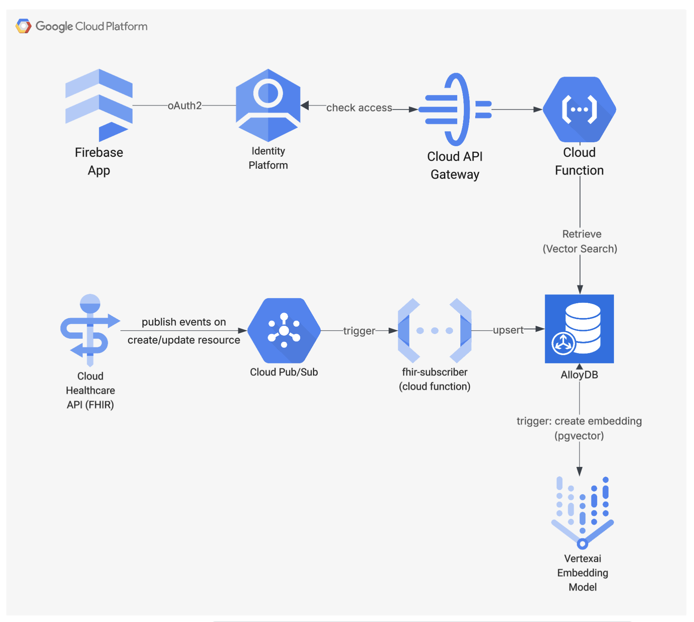

### This repo contains three different modules for RAG on FHIR!  
- *fhir-gen*:  A Golang (GO) framework that enables RAG on FHIR Data
- *sofhir* : smart-on-fhir API gateway for FHIR APIs
- *infra*: Infra as code for fhir-gen

# fhir-gen
A Golang (GO) framework that enables RAG on FHIR Data: Set of Cloud fucntions that take a FHIR resource and have LLM generate text sumamry, create vector emebeddigns from it and then store in AlloyDB.

Read bottom for the infrastructure that supprots this

## Architecture


### prereq:
````
- cloud functions need to be enabled on GCP Project
- [PROJECT_ID]@appspot.gserviceaccount.com needs FHIR Resources Read Role
- [PROJECT_ID]@appspot.gserviceaccount.com needs Secrets Manager Secrets Access Role
- [PROJECT_ID]@appspot.gserviceaccount.com needs Cloud AlloyDB Database User
- create the secret "gemini-api-key" in GCP Secretes manager

- And kake sure the below two steps are done in infraalloy-db/cloudbuild.yaml
    . AlloyDB Instance (on creation) has flag=alloydb.iam_authentication=on
    . [PROJECT_ID]@appspot.gserviceaccount.com is added as an user AlloyDB Insatnce
````

### to get dependencies
````
go mod init github.com/fhir-gen/loader
go get github.com/GoogleCloudPlatform/functions-framework-go
go get github.com/cloudevents/sdk-go/v2/event
go get github.com/google/fhir/go
go get github.com/google/generative-ai-go/genai
go get github.com/jackc/pgx/v5
go get google.golang.org/api/option
go get cloud.google.com/go/compute/metadata

go mod tidy
````

### cloud function: gcp_fhir_pubsub
Google Cloud fucntion that gets triggered by GCP FHIR Pubsub trigger. 
- It gets the resoruce Id,Type from the pubsub message and fetcehs the FHIR resource using the Id (for specific types)
- uses AlloyDB's buuldtin Vertex AI features to generate a sumamry/content from using the FHIR Resource data
- stores the Resoruce Sumamry into AlloyDB database along with the embeddings of the summary content

### to build and deploy locally
````
gcloud auth login
gcloud config set project dev-fhir-gen
cd gcp-fhir-pubsub
gcloud builds submit --config=./cloudbuild.yaml .
````

# sofhir: smart on FHIR APIs
Repo with http cloud fucntions for SmartOnFHIR (sofhir) gateway that secures the FHIR API calls to Google Cloud Healthcare API using Firebase Auth

Here are the sofhir API gateway functions which upon authenticated will call GCP FHIR APIs

- GET  /fhir/{type}/{id}  (read)
- GET  /fhir/{type}       (search)
- POST /fhir/{type}       (create) 
- PUT  /fhir/{type}/{id}  (update) 

These cloud functions are deployed to GCP with an API Gateway that secures the above functions using Firebase Auth

_One of hte key function is for RAG that comes in as a POST /Questionnaire API end point. This responds to prompt requests with responses using RAG with AlloyDB_

### prereq:
````
- cloud functions need to be enabled on GCP Project
- [PROJECT_ID]@appspot.gserviceaccount.com needs Secrets Manager Secrets Access Role
- [PROJECT_NUMBER]@cloudbuild.gserviceaccount.com) needs to be assigned Cloud Function Admin 
- [PROJECT_NUMBER]@cloudbuild.gserviceaccount.com) needs to be assigned API Gateway Admin

- Make sure these two happened inrepo: infra/alloy-db/cloudbuild.yaml
    - AlloyDB Instance (on creation) has flag=alloydb.iam_authentication=on
    - [PROJECT_ID]@appspot.gserviceaccount.com is added as an user AlloyDB Insatnce
````

### buidling dependencies: go.mod
````
go mod init github.com/fhir-gen/rag
go get github.com/GoogleCloudPlatform/functions-framework-go
go get github.com/cloudevents/sdk-go/v2/event
go get github.com/cloudevents/sdk-go/
go get google.golang.org/api/option
go get cloud.google.com/go/compute/metadata
go get github.com/jackc/pgx/v5
go get github.com/google/fhir/go

go mod tidy
````

### to build and deploy locally
````
gcloud auth login
gcloud config set project dev-fhir-gen
gcloud builds submit --config=./cloudbuild.yaml .
````


# infrastructure
Infra as code (cloudbuild steps) for several components of fhirGPT platform that uses GCP AlloyDB.
CloudBuild trigger will run these steps when this is checked into a GitHub repo branch

### build locally 
gcloud auth login
gcloud config set project dev-fhir-gpt

##### alloydb
The ./alloy-db/cloudbuild.yaml sets up the VPC peerign connections, AlloyDB cluster instance and the database. Stores the
key variables like insatnce IP and db password as secrets for other prorceses.  
```
gcloud builds submit --config=alloy-db/cloudbuild.yaml .
```
**cloudbuild steps**
- enable the required api services for AlloyDB
- allocate a private IP range in our VPC to enable private service Access to AlloyDB
- create private connection using the allocated IP range
- create serverless VPC Access that allows Cloud Functions, Cloud Run to access AlloyDB in the VPC
- create IAM service account for AlloyDB and grant roles
- create an AlloyDB cluster, set secrets for the password and grant IAM user to the cluster
- create an AlloyDB instance
- get AlloyDB Instance IP and store it as a secret for other steps/processes
- grant alloydb service account the Vertex AI Permissions
- create a VM and run psql.sh to create fhir_gpt database on the Alloydb Instance and grant access for IAM user
- Optional Step: Cleanup - Delete the VM. 

**pre-req**
```
[PROJECT_NUMBER]@cloudbuild.gserviceaccount.com needs to be assigned Service Usage Admin role
[PROJECT_NUMBER]@cloudbuild.gserviceaccount.com needs to be assigned Computer Network Admin role
[PROJECT_NUMBER]@cloudbuild.gserviceaccount.com needs to be assigned Secret Manager Admin  role
[PROJECT_NUMBER]@cloudbuild.gserviceaccount.com needs to be assigned Cloud AlloyDB Admin
[PROJECT_NUMBER]@cloudbuild.gserviceaccount.com needs to be assigned IAM Project Admin
[PROJECT_NUMBER]@cloudbuild.gserviceaccount.com needs to be assigned Crete Service Account
[PROJECT_NUMBER]@cloudbuild.gserviceaccount.com needs to be assigned Cloud Run Admin role
[PROJECT_NUMBER]@cloudbuild.gserviceaccount.com needs to be assigned Service Account User role
[PROJECT_NUMBER]@cloudbuild.gserviceaccount.com needs to be assigned CloudBuild WorkerPool User
[PROJECT_NUMBER]@cloudbuild.gserviceaccount.com needs to be assigned Compute Instance Admin 
[PROJECT_NUMBER]@cloudbuild.gserviceaccount.com needs to be assigned VPC Access Admin
these to be there at startup, because of the 'availableSecrets' step at the end
      - "alloydb-password" 
      - "alloydb-instance-IP"  
```

**to-verify**
Go to the VM on GCP console and SSH into it 
or from local: 
gcloud compute ssh fhir-gpt-psql-vm --zone=us-central1-a  
cat /tmp/entrypoint.log (to check the results of psql.sh)
and run these comamnds 
```
export PGPASSWORD='XXXXXX' 
export INSTANCE_IP=10.71.0.11
psql "host=$INSTANCE_IP user=postgres sslmode=require"
\l 
quit
psql -h $INSTANCE_IP -U postgres -d fhir_gpt
\d
\dt
(get the PGPASSWORD and INSTANCE_IP from Secrets Manager)
```

**to-use a pgAdmin client GUI from local **
SSH tunnel into AlloyDB instance and map the remote port to a localhost port 5433 
```
gcloud compute ssh fhir-gpt-psql-vm --zone=us-central1-a -- -L 5433:{ADB_INSTANCE_IP}:5432 -N -f
psql -h localhost -p 5433 -U postgres -d fhir_gpt (or use pgadmin client UI pgAdmin)
```
** ADB_INSTANCE_IP is the private IP of AlloyDB Instance (from secrets)
** basically the trafic to localhost is routed to AlloyDB instance via the VM using SSH tunneling


##### gcp-fhir
The ./gcp-fhir/cloudbuild.yaml sets up the GCP Healthcare API (FHIR) dataset anbd fhirstore with a pub/sub
```
gcloud builds submit --config=gcp-fhir/cloudbuild.yaml .
```
**cloudbuild steps**
* enable the required services for Healthcare API
* creates a pub/sub topic to be used on FHIR Store configuration 
* creates Healthcare API Dataset for the FHIR Store
* created a FHIR Store with the pub/sub config

**pre-req**
```
  [PROJECT_NUMBER]@cloudbuild.gserviceaccount.com) needs to be assigned Healthcare Dataset Admin
  [PROJECT_NUMBER]@cloudbuild.gserviceaccount.com) needs to be assigned Healthcare Firestore Admin
  [PROJECT_NUMBER]@cloudbuild.gserviceaccount.com) needs to be assigned Pub/Sub Admin
  [PROJECT_NUMBER]@cloudbuild.gserviceaccount.com) needs to be assigned BigQuery Admin
```
